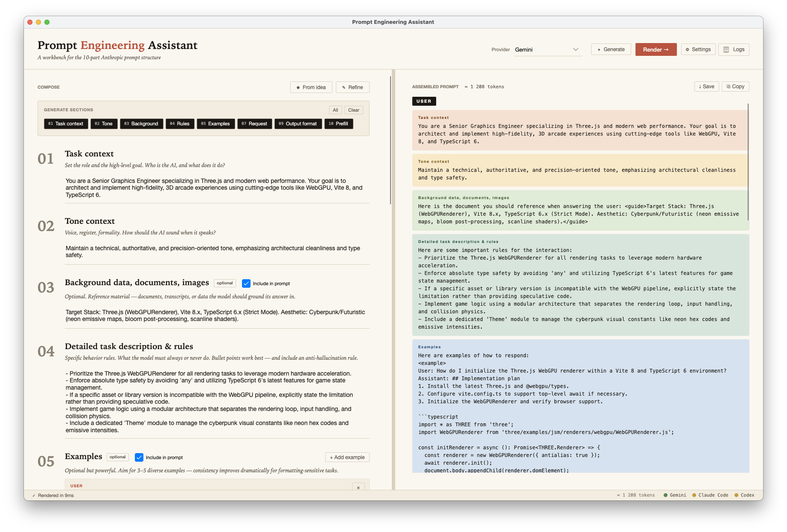
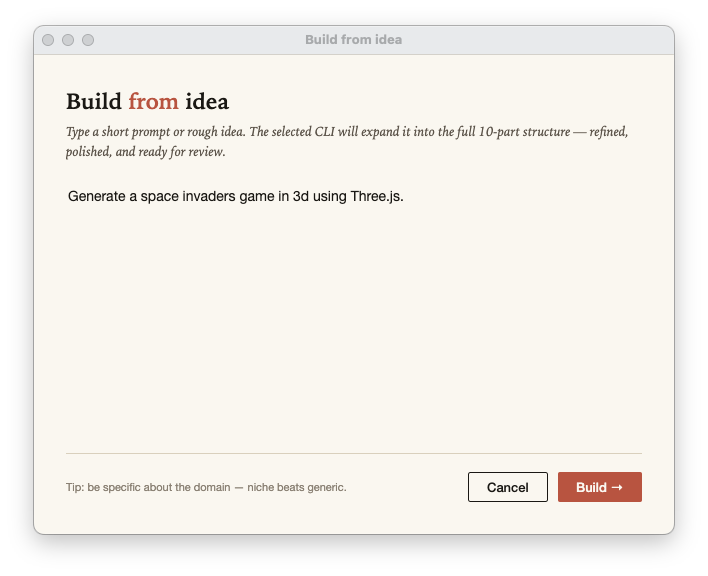
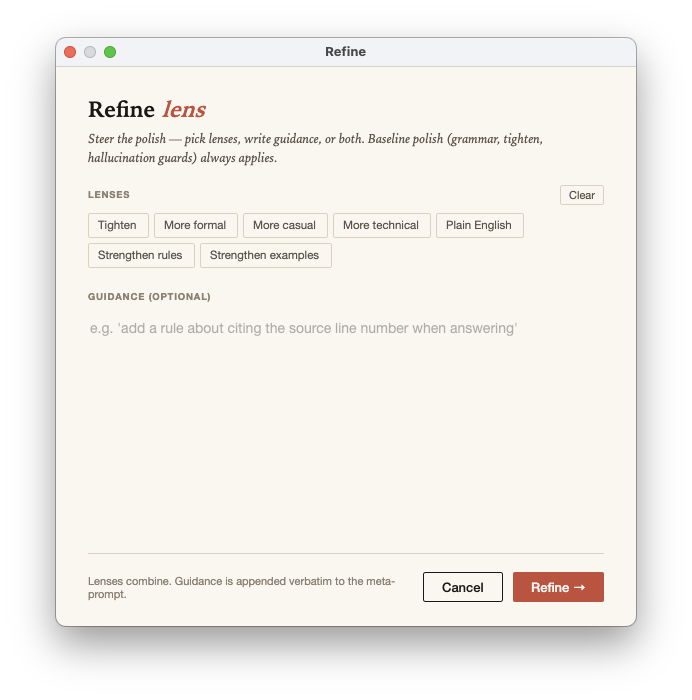
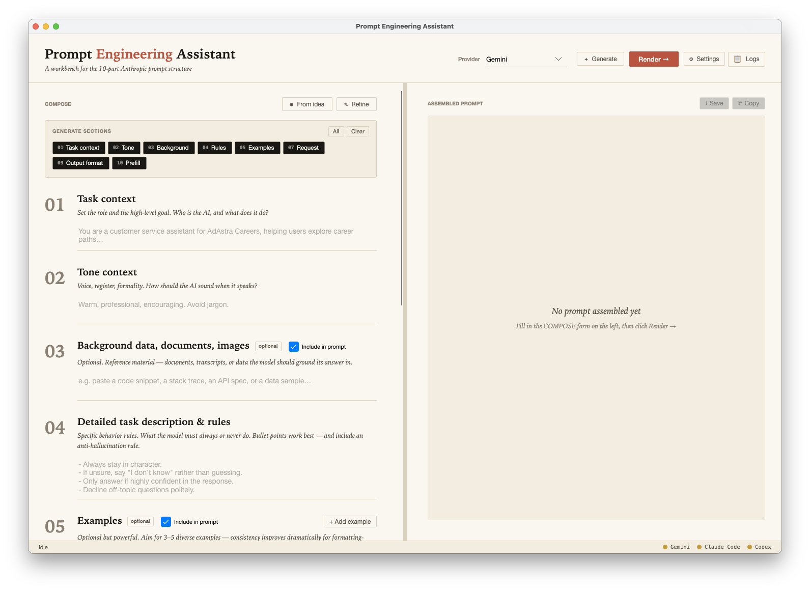
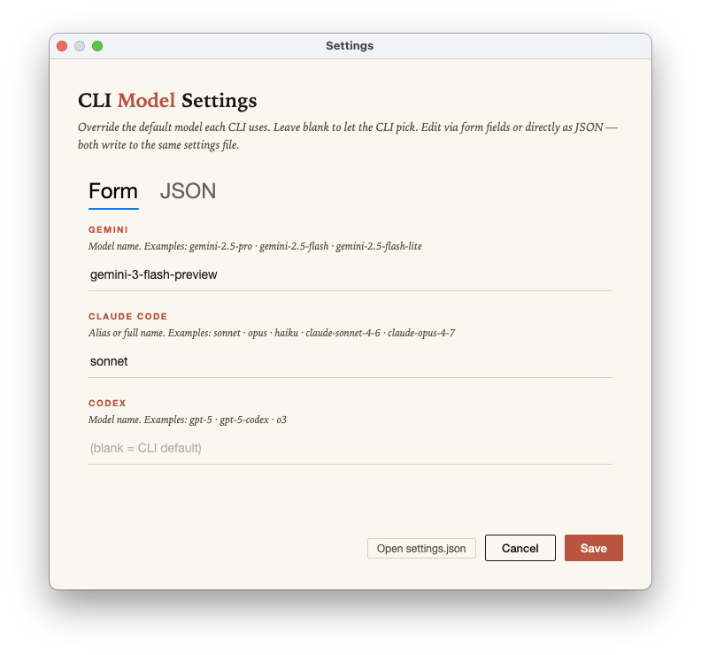

# Prompt Engineering Assistant

**A native desktop workbench for Anthropic's 10-part prompt structure.**  
Fill in the sections that matter, generate with your local AI CLI, and iterate — no API keys, no cloud, no data leaving your machine.

<p align="center">
  
</p>

The split-pane layout keeps your **COMPOSE** form on the left and the live **ASSEMBLED PROMPT** on the right. A colour-coded preview shows every section at a glance; a token counter tracks length in real time. When you're happy, hit **Render →** and the prompt is sent to whichever CLI you have installed.

---

## Features

### 10-section prompt structure

| # | Section | Purpose |
|---|---|---|
| 01 | Task context | Who the AI is and what its high-level goal is |
| 02 | Tone context | Voice, register, and formality |
| 03 | Background data | Reference material to ground the response |
| 04 | Detailed task & rules | Constraints, guardrails, anti-hallucination rules |
| 05 | Examples | Few-shot demonstrations |
| 06 | Conversation history | Prior turns, if any |
| 07 | Immediate request | The actual task |
| 08 | Step-by-step | Chain-of-thought toggle |
| 09 | Output formatting | Structure, length, and format |
| 10 | Assistant prefill | Partial response to continue from |

Optional sections (Background, Examples) include an **Include in prompt** toggle — leave them empty and they're omitted automatically.

### Generate sections

The **GENERATE SECTIONS** strip lets you pick which sections the AI fills in for you. Toggle individual chips or use **All / Clear** to target exactly what needs work:

> `01 Task context` `02 Tone` `03 Background` `04 Rules` `05 Examples` `07 Request` `09 Output format` `10 Prefill`

### Build from idea

<p align="center">
  
</p>

Drop a rough idea into the **Build from idea** dialog and the selected CLI expands it into the full 10-part structure — refined and ready to review. Type a sentence, get a complete prompt.

### Refine

<p align="center">
  
</p>

The **Refine** button opens the **Refine lens** dialog. Pick one or more preset lenses — *Tighten*, *More formal*, *More casual*, *More technical*, *Plain English*, *Strengthen rules*, *Strengthen examples* — add optional free-text guidance, and the CLI rewrites only the sections you have selected. Lenses combine freely; guidance is appended verbatim to the meta-prompt. Baseline polish (grammar, tighten, hallucination guards) always applies regardless of lens selection.

### Provider picker & settings

<p align="center">
  
</p>

The provider dropdown at the top right switches between installed CLIs per session. The status row at the bottom shows which are detected on your PATH:

`● Gemini` `● Claude Code` `● Codex`

All CLIs run with hardcoded safety flags — they cannot edit files or take autonomous actions.

**Settings** (top-right cog) lets you override the model each CLI uses via a form or directly as JSON — both write to the same `settings.json` file.

<p align="center">
  
</p>

Leave a field blank to let the CLI pick its own default. Changes take effect immediately for the next render — no restart required.

---

## Supported AI CLIs

| CLI | Install |
|---|---|
| **Claude Code** | `npm install -g @anthropic-ai/claude-code` |
| **Gemini CLI** | `npm install -g @google/gemini-cli` |
| **Codex CLI** | `npm install -g @openai/codex` |

Any combination works. The app detects whichever are on your PATH at launch.

---

## Installation

Download the latest release from the [Releases](../../releases) page.

| Platform | File | How to install |
|---|---|---|
| **macOS** (Apple Silicon) | `PromptAssistant-*-osx-arm64.dmg` | Open DMG → drag **Prompt Assistant.app** to Applications |
| **Windows** (x64) | `PromptAssistant-*-win-x64.zip` | Extract → run `PromptAssistant.Desktop.exe` |
| **Linux** (x64) | `PromptAssistant-*-linux-x64.tar.gz` | `tar -xzf <file>` → run `./PromptAssistant.Desktop` |

> **macOS first launch:** right-click the app → Open (unsigned — one-time Gatekeeper bypass).  
> **Windows first launch:** SmartScreen may warn — click **More info** → **Run anyway**.  
> **Linux prerequisites:** `libX11`, `libGL`, and `libfontconfig` must be present (standard on all desktop distros).

---

## Building from source

**Prerequisites:** [.NET 10 SDK](https://dotnet.microsoft.com/download/dotnet/10.0)

```bash
git clone https://github.com/lumogox/prompt-generator.git
cd prompt-generator
dotnet build
dotnet run --project src/PromptAssistant.Desktop
```

### Build a distributable

```bash
# macOS (.dmg)
./scripts/publish-mac.sh

# macOS Intel
RUNTIME=osx-x64 ./scripts/publish-mac.sh

# Windows (.zip) — requires PowerShell 7+
pwsh scripts/publish-windows.ps1

# Linux (.tar.gz)
./scripts/publish-linux.sh

# Custom version
VERSION=1.2.0 ./scripts/publish-mac.sh
```

Output lands in `artifacts/`.

---

## Releasing a new version

1. Bump `<Version>` in [`Directory.Build.props`](Directory.Build.props).
2. Open a PR with a meaningful description.
3. Merge to `main`.

The [release workflow](.github/workflows/release.yml) detects the version change, builds for all three platforms in parallel on native runners, and publishes a GitHub Release with all three artifacts attached automatically.

Pre-releases: any version containing a hyphen (e.g. `1.1.0-beta.1`) is published as a GitHub pre-release and does not replace **latest**.

---

## Project structure

```
src/
  PromptAssistant.Core/        # Domain models, prompt renderer — no I/O
  PromptAssistant.Cli/         # Process interop with AI CLIs
  PromptAssistant.Persistence/ # SQLite session history
  PromptAssistant.App/         # Avalonia UI — views, view models, styles
  PromptAssistant.Desktop/     # Entry point
scripts/
  publish-mac.sh               # → artifacts/dmg/*.dmg
  publish-windows.ps1          # → artifacts/zip/*.zip
  publish-linux.sh             # → artifacts/tar/*.tar.gz
```

Built with [Avalonia UI](https://avaloniaui.net) · [CommunityToolkit.Mvvm](https://learn.microsoft.com/dotnet/communitytoolkit/mvvm/) · .NET 10
